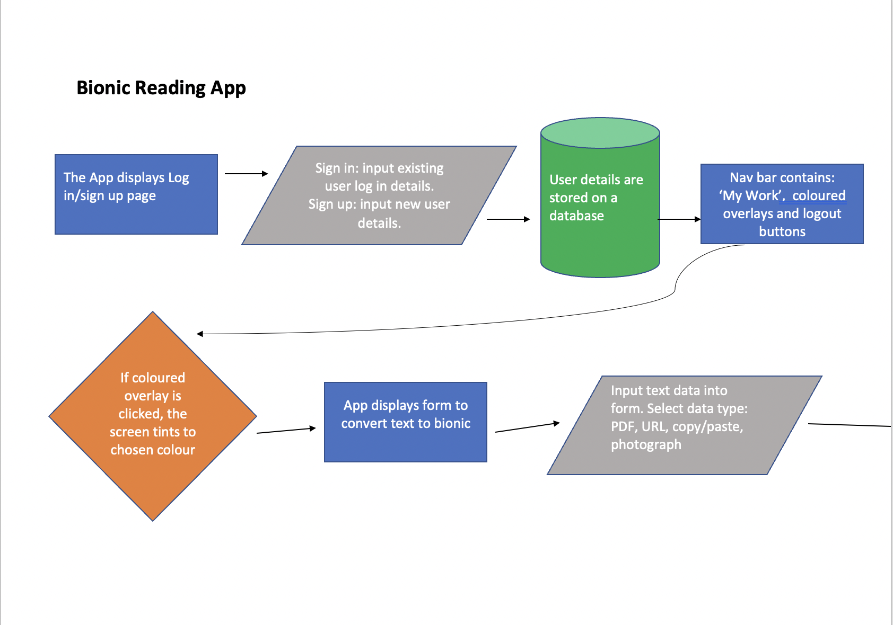
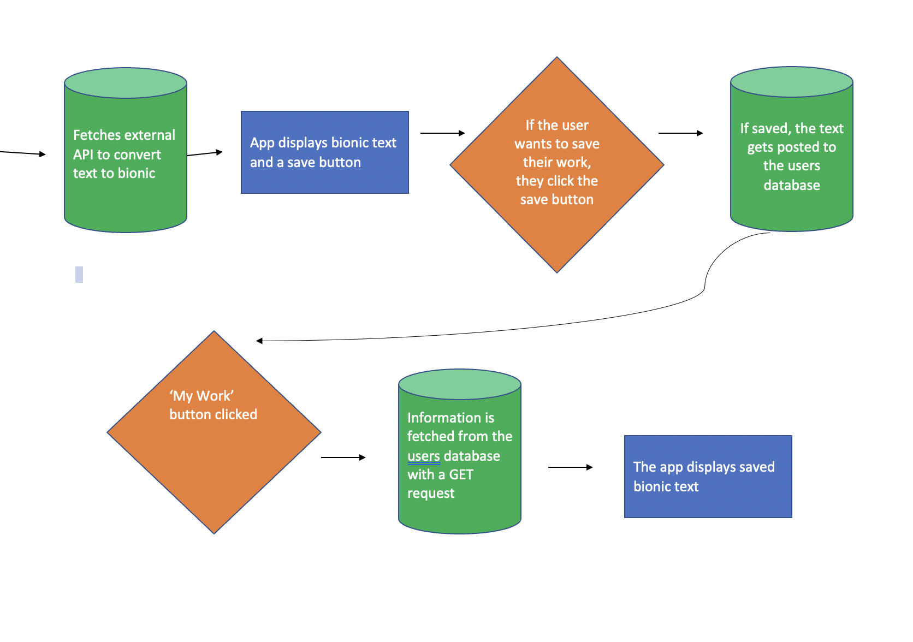
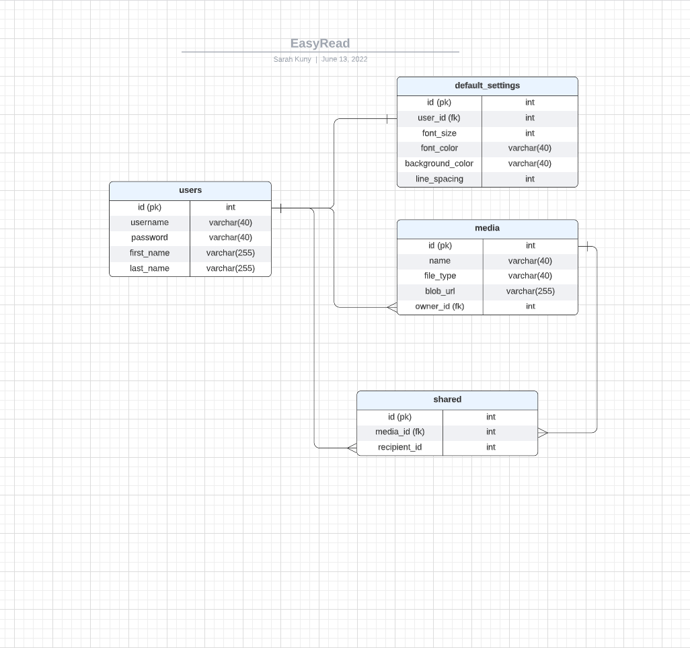

# EasyRead


## Architecture

## Front-End
### User Flow Diagram




## Back-End
### Database Schema


## Setup

### Dependencies
- BACKEND: Run 'npm install' in project directory. 
- FRONTEND: 'cd client' and run 'npm install'

### Database Prep
- Access the MySQL interface in your terminal by running 'mysql -u root -p'
- Create a new database called easyread: 'create database easyread;'
- Add a '.env' file to the project directory containing MySQL authentication, for example:

```bash
  DB_HOST=127.0.0.1
  DB_USER=root
  DB_NAME=easyread
  DB_PASS=YOURPASSWORD
```

- In a new terminal: in the project directory run 'npm run migrate' to create tables within the easyread database
- To view structure of tables, in MySQL console:
    - 'use easyread;'
    - 'describe users'

### Development
- BACKEND TERMINAL: in project directory run 'npm start' (runs on port 5000)
- FRONTEND TERMINAL: 'cd client' then 'npm start' (runs on port 3000)


    