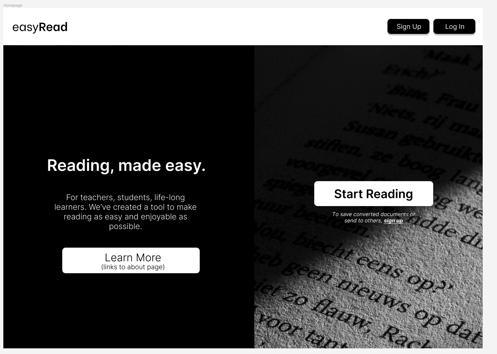
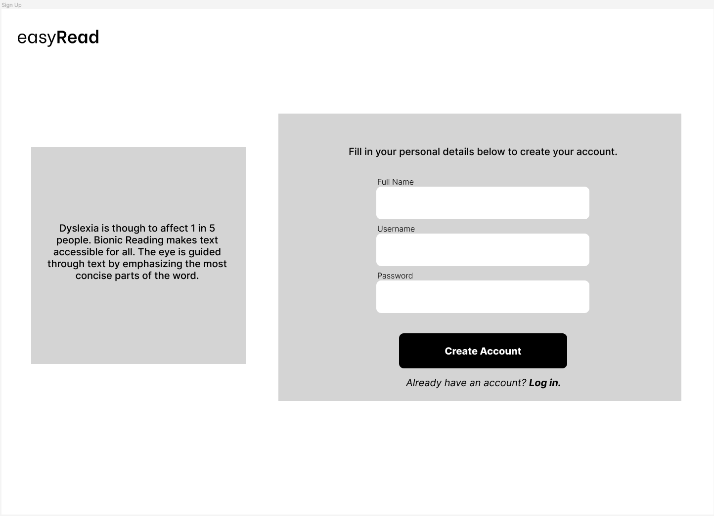
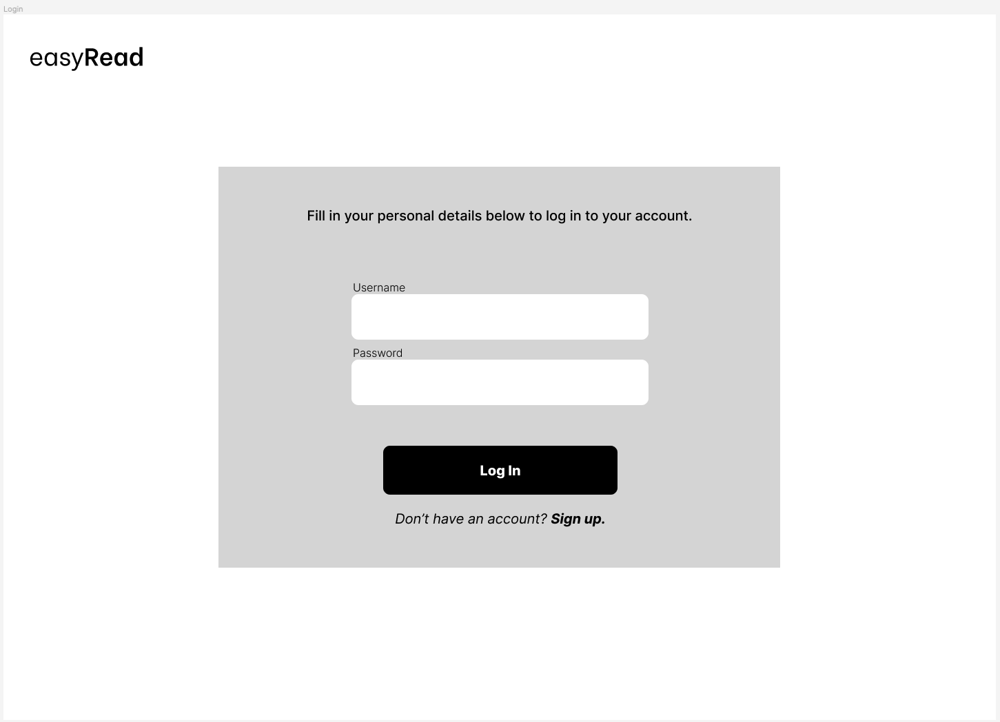
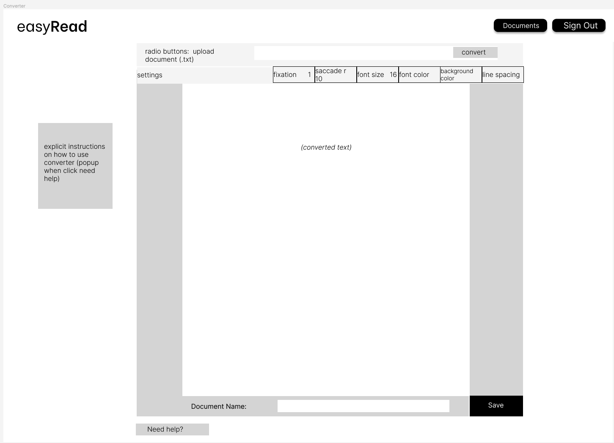
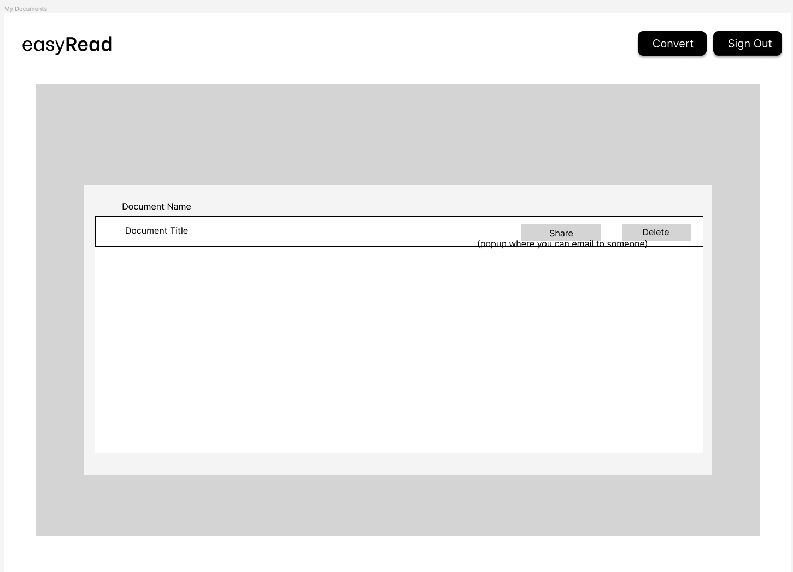
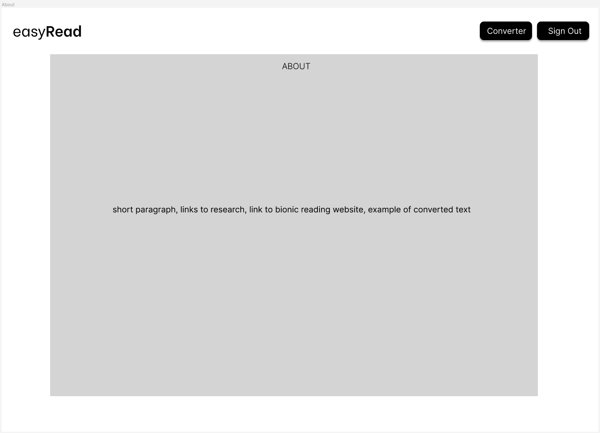
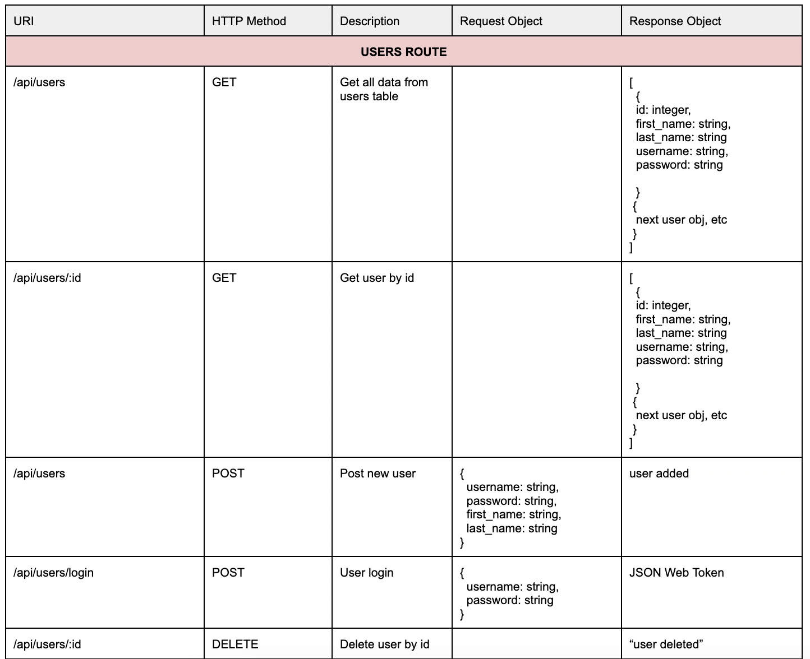
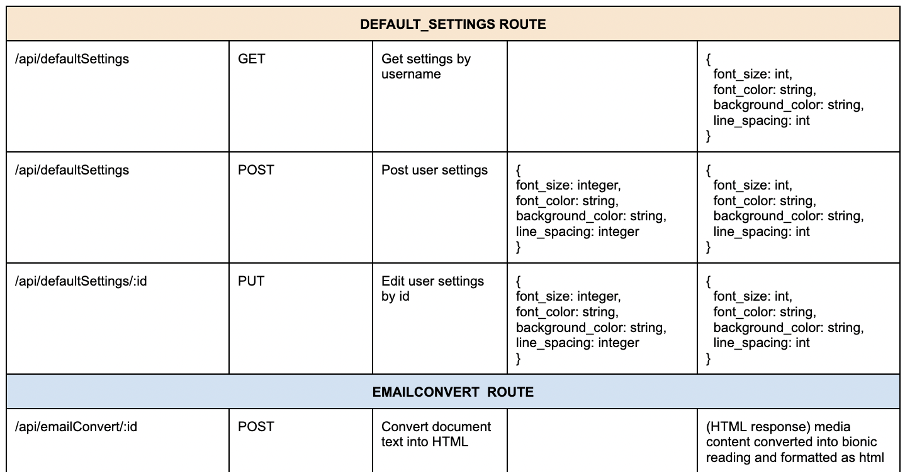
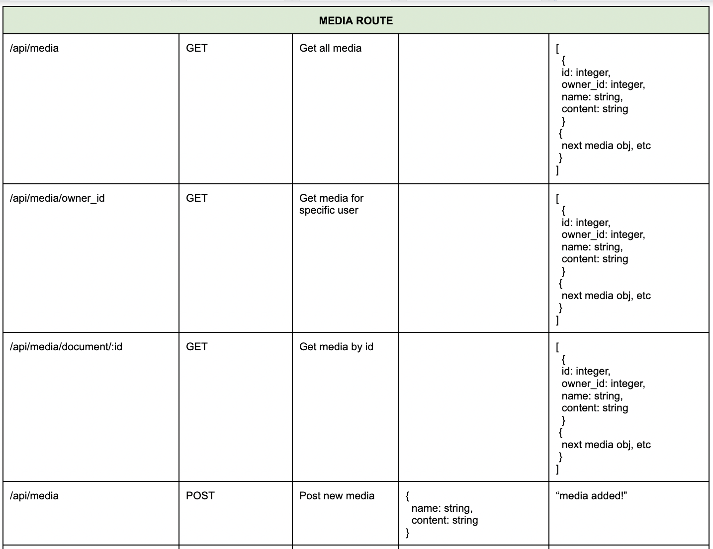
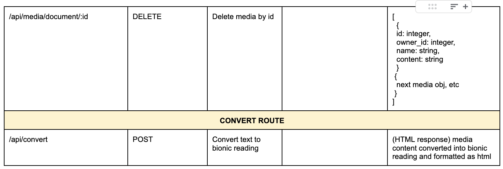

# easyRead

## easyRead is a full-stack app that makes reading accessible for all. Developed as a solution for those with dyslexia, stroke patients, students, teachers, or anyone looking to make reading an easier experience, easyRead leverages the Bionic Reading API and dynamic UI elements to configure text to work for you. Visit the about page to learn more.

---

# Architecture

## Front-End

### Wire-Frame








### User Flow Diagram


## Back-End

### Database Schema


### API Routes






## Setup

### Dependencies

- BACKEND: Run 'npm install' in project directory.
- FRONTEND: 'cd client' and run 'npm install'

### Database Prep

- Access the MySQL interface in your terminal by running 'mysql -u root -p'
- Create a new database called easyread: 'create database easyread;'
- Add a '.env' file to the project directory containing MySQL authentication, access token for jwt, and API key for the bionic reading API.
- to generate secret key:
  - open terminal, type node, then type:
  - require('crypto').randomBytes(64).toString('hex')

```bash
  DB_HOST=127.0.0.1
  DB_USER=root
  DB_NAME=easyread
  DB_PASS=YOURPASSWORD
  API_KEY= [get API key from bionic reading API]
  ACCESS_TOKEN_SECRET= [generated secret key - see above]
```

- In a new terminal: in the project directory run 'npm run migrate' to create tables within the easyread database
- To view structure of tables, in MySQL console:

  - 'use easyread;'
  - 'describe users'

- In a new terminal, install the following packages in the backend:

### Development

- BACKEND TERMINAL: in project directory run 'npm start' (runs on port 5005)
- FRONTEND TERMINAL: 'cd client' then 'npm start' (runs on port 3000)
